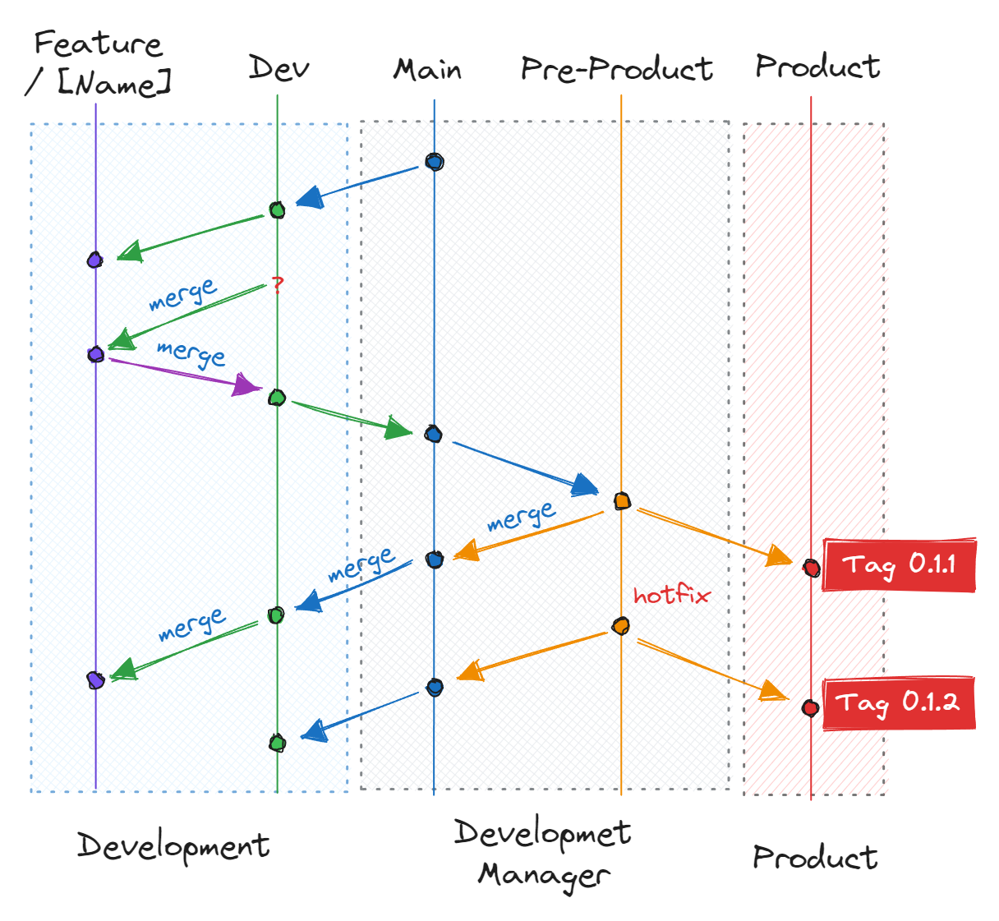

# Git 사용 가이드

## Git 커밋 메시지 작성 규칙

**포맷:**

```
<type>: <subject>

<body>
```

**커밋 타입 (Type):**

-   feat: 새로운 기능 추가
-   fix: 버그 수정
-   docs: 문서 수정
-   style: 코드 포맷팅, 세미콜론 누락, 코드 변경이 없는 경우
-   refactor: 코드 리팩토링
-   test: 테스트 코드, 리팩토링 테스트 코드 추가
-   chore: 빌드 업무 수정, 패키지 매니저 수정

**제목 (Subject):**

-   변경 사항에 대한 간단한 설명
-   50자 이내로 작성
-   마침표 없이 작성
-   현재 시제 사용

**본문 (Body):**

-   변경 사항에 대한 자세한 설명
-   어떻게 보다는 무엇을, 왜 변경했는지 설명
-   여러 줄의 메시지를 작성할 땐 "-"로 구분

**예시:**

```plaintext
feat: 로그인 화면 키보드 UX 개선
- TextInput ref를 사용하여 자동 포커스 기능 추가
- returnKeyType 설정으로 키보드 엔터키 동작 개선
- 전화번호 입력 후 자동으로 비밀번호 입력창으로 포커스 이동
- 비밀번호 입력 후 엔터키로 로그인 가능하도록 개선
```


## Branch Flow

### 주요 branches



- `main` :  **주요 개발 흐름**을 가지고 있습니다. **개발을 진행하지 않으며**, dev와 pre-product의 중간 버퍼 역할을 합니다.
- `dev` : **개발의 흐름**을 담당합니다. 개발의 주요 기능을 머지 하며 보관 합니다.
- `Feature/[Name]` **추가 기능** 및 **개인 개발 공간** 입니다.  feature 하위에는 개인의 아이디로 폴더를 만들어서 사용하고, 개인의 용도에 맞춰서 이름을 생성해서 제작 합니다.  개인마다, 기본적으로 **dev**라는 브랜치를 가지고 있고 이 브랜치는 dev의 개발을 따라 가면서 개발을 합니다.  장기적인 개발이 필요 하거나, 개발하고 main에 적용을 할지 검토가 필요한 경우, 경우에 맞게 브랜치를 따서 작업을 합니다.

    예)
    > feature/gyuha/dev :  특별한 기능없이 dev의 개발 용 브랜치
    > 
    > feature/gyuha/layout : layout 개발용, 서버 반영은 테스트 후 확정
- `pre-product` : 개발이 완료 후 product에 배포하기 전에 테스틑 진행하는 branch입니다. QA에서 테스트를 진행하고 이상이 없을 시 product으로 머지합니다.
- `product` : 배포 확인용 브랜치 입니다. 배포가 완료 되면 현재 브랜치에는 Tag를 지정해 줍니다.

### 규칙
- `dev to feature` : feature에서 개인적인 개발을 하고 있더라도, 되도록 이면 dev의 최신 버전을 유지할 수 있도록 dev에서 merge를 자주 받습니다.
- `feature to dev` : feature의 개발 완료 후 dev로 머지 합니다. 머지하기 전에는 꼭 dev의 내용을 머지 해 줍니다.
- `pre-product to product` : 테스트가 완료 된 버전은 product으로 merge 해 줍니다.
- `tag` : `product`에 배포가 되면 tag를 지어 줍니다. 출시 버전에 대해 태그를 생성합니다. (예: Tag 0.1.1, 0.1.2)
- `hotfix` : `product`에 배포 된 버전에서 문제가 발생 했을 시에는 `pre-product`에서 소스를 수정 해 줍니다. 


## 주의사항
- Pull Request와 코드 리뷰 필수
- 빌드 성공 요구사항
- 정기/긴급 배포 프로세스 준수